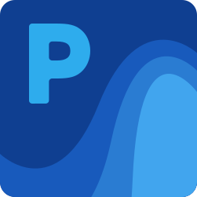

# Pixeval

基于.NET 10 和 Avalonia 的强大、快速、漂亮的Pixiv第三方应用程序

🌏: [**简体中文**](README.md)，[English](README.en.md)，[Русский](README.ru.md)，[Français](README.fr.md)

---

**基于Avalonia的Pixeval已经正在开发中，而旧的WPF版本不再进行大量维护，请适时切换到新版Pixeval。**

> 仅支持 Windows 7及更高版本。

更多详细信息请前往 [项目主页](https://pixeval.github.io/) 查看

**WinUI3版本提供了更好的UI，更好的项目结构以及更好的开发体验，如果你想要了解目前的开发进度，可以通过以下方法来下载并编译该项目：**

## 环境要求

1. 拥有[git](https://git-scm.com)环境
2. 安装[Visual Studio 2026](https://visualstudio.microsoft.com/vs)或更高，或[JetBrains Rider](https://www.jetbrains.com/rider/)。
3. 对于VS2026用户：在**工具-获取工具与功能**的**工作负载**中选择 **.NET 桌面开发**。

## 运行项目

1. 用Git克隆本项目
2. 如果 Pixeval.Desktop 不是启动项目，请将其设置为启动项目
3. 构建并运行

* 如果失败可以尝试重新生成解决方案或者重启Visual Studio 2026

## 参与开发的要求

1. 对Avalonia的基本了解，要了解更多相关信息请看 [Avalonia文档](https://docs.avaloniaui.net/)（或拥有WPF/UWP/WinUI 3相关经验）
2. 对C#和.NET开发的一定了解以及开发经验
3. 具有不依赖文档阅读代码的能力

## 项目版本控制

本项目采用一个简单的Git分支模型：当您在进行开发的时候，请基于`main`创建新的分支，新的分支格式**必须**遵循`{user}/{qualifier}/{desc}`，其中`{user}`是您的用户名。

| 代码内容 | qualifier | desc |
| - | - | - |
| 漏洞修复 | fix | 漏洞的简要叙述 |
| 新功能 | feature | 新特性的简要叙述 |
| 重构或者代码质量提升 | refactor | 重构部分的简要叙述 |

如果您的贡献包含不止一种上面提到的类型，则应当遵循和您的贡献最为相关的一项，并在commit信息中提及其他类型上的贡献

在开发完成后，请发布 [Pull Request](https://github.com/Pixeval/Pixeval/pulls) 请求合并到`main`分支

## 项目结构

1. Pixeval 项目包含了项目本身的逻辑及布局代码

## 反馈问题（按照推荐程度优先级排序）

1. 在 [github](https://github.com/Pixeval/Pixeval/issues/new/choose) 提交新的Issue
2. 给 [decem0730@hotmail.com](mailto:decem0730@hotmail.com) 发送邮件
3. 加入QQ群815791942来面对面的和开发者反馈问题

## 鸣谢（排名不分先后）

Made with [contrib.rocks](https://contrib.rocks).

## 支持作者

如果你感觉该项目帮助到了你，欢迎前往[爱发电](https://afdian.net/@dylech30th)赞助我，你的支持是我维护项目的动力，谢谢！

  
   
  
  本项目重度依赖于 [JetBrains](https://www.jetbrains.com/?from=ImageSharp) ReSharper，感谢JetBrains s.r.o为本项目提供 [开源许可证](https://www.jetbrains.com/community/opensource/#support)，如果你同样对开发充满热情并且经常使用JetBrains s.r.o的产品，你也可以尝试通过JetBrains官方渠道 [申请](https://www.jetbrains.com/shop/eform/opensource) 开源许可证以供核心开发者使用

