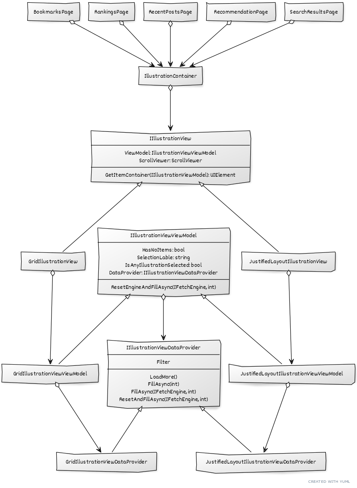

# Architecture and Logic Segregation of IllustrationView
The `IllustrationView` segregates two implementations: `GridIllustrationView` and `JustifiedLayoutIllustrationView`, while allow them to be hot-swapped, the former one is a traditional layout that use `AdaptiveGridView` to hold items, each item will have the same height and width; the latter one, is a `JustifiedLayout` which, only aligned at ends, the images inside a row can have different width.
The architecture is presented simply as the following diagram shows:

Both implementation depends on `IIllustrationViewViewModel` to provide behavioral properties, and `IllustrationViewViewModel` will have a `IllustrationViewDataProvider` to load data when user is panning or scrolling the view, the load will be automatic in `GridIllustrationViewDataProvider` but are made manually in`JustifiedLayoutIllustrationDataProvider` since automatic loading is impossible for the latter case. The `IllustrationViewViewModel` contains logic to interact with `IllustrationViewCommandBar` and `IllustrationViewer`.

At last, the `IllustrationView` will be depended by `IllustrationContainer` which itself is depended by functional pages, and since `IllustrationContainer` depends solely on `IllustrationView`, so it's convenient to hot-swap two possible implementations just by switching to the corresponding `IIllustrationView`, as the following code snippet inside `IllustrationContainer`'s constructor shows:

```cs
IllustrationView = App.AppViewModel.AppSetting.IllustrationViewOption switch
{
    IllustrationViewOption.Regular => new GridIllustrationView(),
    IllustrationViewOption.Justified => new JustifiedLayoutIllustrationView(),
    _ => throw new ArgumentOutOfRangeException()
}; 
IllustrationContainerDockPanel.Children.Add(IllustrationView.SelfIllustrationView);
```

And since the three interfaces: `IIllustrationView`, `IIllustrationViewViewModel`, and `IIlustrationViewDataProvider` segregates the logic from either sides(implementations), two different sides are completely independent, no dependency nor any relation exists.

To refactor, just change the corresponding class of the implementation that you are targeting, for example, if you are seeking to refactor the `GridIllustrationView`, change the `GridIllustrationView`, `GridIllustrationViewViewModel`, and `GridIllustrationViewDataProvider`; in contrast, if you are seeking to refactor the `JustifiedLayoutIllustrationView`, change the `JustifiedLayoutIllustrationView`, `JustifiedLayoutIllustrationViewViewModel`, and `JustifiedLayoutIllustrationViewDataProvider`.